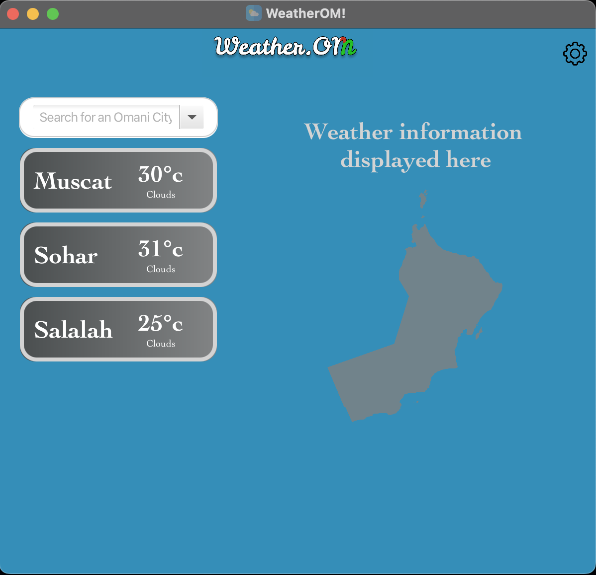
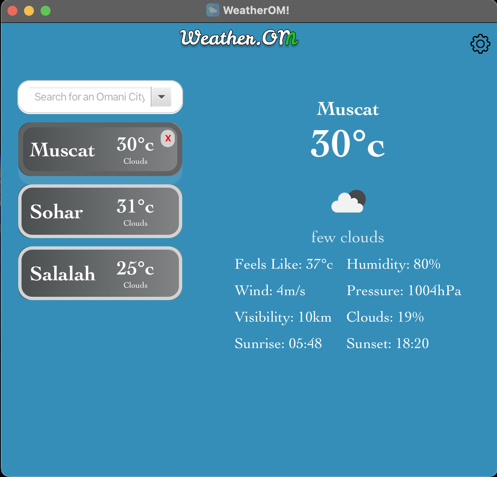
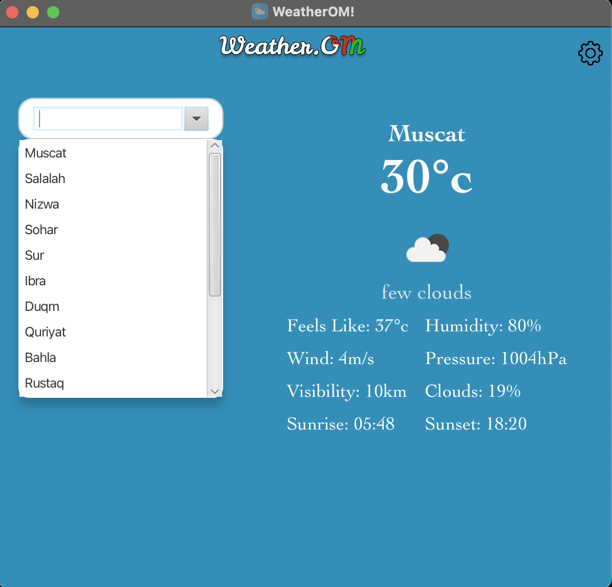

# WeatherOM 🌥️
**WeatherOM** is a JavaFX-based desktop application for viewing **real-time weather information for cities in Oman**. The app is currently **under development** ⚠️. <br>

The **main functionality** - displaying weather for a selected city - is **fully working**, but **additional features** will be added in **future updates**

## Features ⚡️
### Implemented ✨
- 🔍 **Search through the list of supported Omani cities** by typing into the search box
- 📝 **Dynamic weather cards** showing city name, current temperature, and a brief description of current weather
- ❌ **Delete functionality** to remove cities from the list
- 🖥️ **Detailed weather panel** showing:
    - Temperature 🌡️
    - Feels-like temperature 🤗
    - Humidity 💧
    - Wind 💨
    - Pressure ⚖️
    - Visibility 👀
    - Clouds ☁️
    - Sunrise 🌅 / Sunset 🌆
    - Weather icon 🌤️
- 🌐 **Live weather updates** using the **OpenWeatherMap API**
- 🗂️ **JSON parsing** to extract weather information from API responses
- 🎨 **Responsive UI** with hover effects and styled components using ```style.css```

### Under Development 🚧
- **5-day weather forecast**
- **Refresh button** to update weather manually
- **Improved UI responsiveness** including design and animations

## 📂 Project Structure
```
WeatherOM/
│
├── src/main/java/com/weatherom/
│   ├── MainApp.java
│   ├── controllers/MainController.java
│   ├── models/
│   │   ├── WeatherCard.java
│   │   ├── WeatherCardCell.java
│   │   ├── WeatherPanel.java
│   │   └── WeatherService.java
│   └── fileUtil/FileUtil.java
│
├── src/main/resources/com/weatherom/
│   ├── main-view.fxml
│   ├── style.css
│   ├── icons/oman-map.png
│   ├── cityNames.txt
│   ├── config.properties          # contains your API key 🔑
│   └── config.properties.example  # example file without API key
│
└── README.md
```

## ⚙️ Setup Instructions 
1. **Clone the repository**:
```bash
git clone https://github.com/Alsiyabii/oman-weather-app.git
```
2. **Add your OpenWeatherMap API key 🔑**:
    - Copy ```config.properties.example``` to ```config.properties```
    - Open ```config.properties``` and **replace** ```api.key=``` with **your API key**.
3. **Build and run the project** in IntelliJ or your preferred Java IDE

## Usage 👨‍💻
- Type a city name in the ```Search box 🔍``` and select it to display its weather.
- Weather cards are added to the list view and can be deleted using the red ```❌``` button.
- Click a weather card to view detailed information in the main panel on the right🌡️
- Weather information is fetched **live 🌐** from the OpenWeatherMap API and parsed from JSON responses 📄.

## Tech Stack 🛠️
- **Java 17+**
- **JavaFX** (GUI)
- **JSON** (parsing OpenWeatherMap API response)
- **OpenWeatherMap API**
- **CSS** (UI and component editing)

## Notes ⚠️
- This app is **still under development**, some features may be incomplete or missing.
- Ensure ```cityNames.txt``` is **writable** to **allow saving and deleting cities**.
- **API key** must be provided in ```config.properties``` for **live weather updates**

## Screenshots 📸
<p><b> Initial app screen </b></p>

<br>

<p><b> Upon selecting "Muscat"</b></p>

<br>

<p><b> The list of cities to choose from </b></p>

<br>

## License 📜
This project is licensed under the [MIT License](LICENSE)